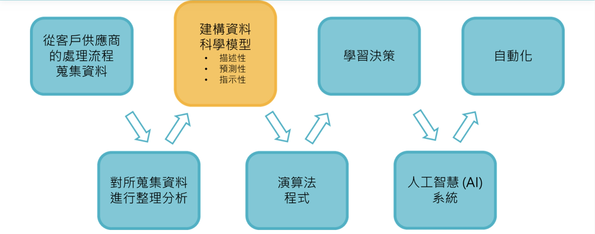

# AI 的應用

 

 

---

 

 

## 一般零售業導入 AI

隨著零售業務資料每1.2年增加一倍，連帶零售資料持續爆炸。他說，零售資料包括消費者購買數據、線上瀏覽資料、社群媒體數據、行動交易使用資料和客戶滿意度資料。例如，像沃爾瑪這樣的零售商每小時就可以收集大約100萬筆交易的數據、貢獻出2.5TB的資料。零售業是人工智慧使用和發展上的豐富來源。

為了利用這些迅速發展的資料，零售商正在投資各種AI應用程式，估計到2022年，預計零售商對人工智慧的支出可達60億美元。而AI的勢力正同時影響需求和供給兩端。
在需求方面，人工智慧能協助零售商更佳了解和預測客戶需求，並做出最佳決策以提高客戶的終身價值。AI並可使供應鏈變得更有效率並優化庫存管理與物流。而AI能還協助購物者和消費者做出決策，改變他們與零售商的關係。

AI在零售業的運用架構，如圖1所示。

流程圖 : 

在這個架構中，製造商和零售商不斷地從上下游等多重來源，蒐集關於顧客態度與行為的資料，並存儲於資料倉儲設備中。接著對所蒐集的資料進行分析，並建構出資料科學模型。而這類模型稱為「機器學習模型」，能從有用的資料中學習，並做出預測性決策。

這些機器學習模型形成人工智慧系統的基礎，進而提供自動化的服務。例如，透過聊天機器人協助進行顧客服務，或在另一端透過智慧機器人協助零售商將倉儲、零售據點予以自動化。

 
 

## 即時動態定價策略與實做

動態定價顧名思義是一種採取變動價格的定價方式。在電子商務的世界裡，透過資料科學的分析與應用，產品價格變化的時間間距，可以小到以分秒來計。根據報導，亞馬遜於2013年，平均每天有超過250萬次的動態價格調整。