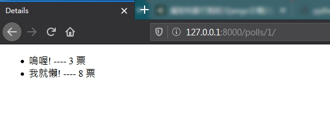

# using template

<br>

再前面章節提到過，要想 Server 對瀏覽器做出回應，我們直接使用

```py
    return HttpResponse("mysite Server 回應你了喔 XD!~")
```

當我們僅需要 Server 向客戶端回應一段 JSON 資料時，可以這樣使用，但是如果是要回應一個 html 文件呢 ?

<br>
<br>

## Template 介紹

* Template 是什麼 ? 事實上，無論我們如何掙扎，python 回應瀏覽器使用的方式都離不開 `HttpResponse` 物件。也就是說我們想要回應客戶端一個簡單的歡迎頁要如下做：

    ```py
    def index(request):
        html = '''
        <html>
            <head>
                <title>你好阿</title>
            </head>
            <body>
                <h1>Welcome to my site</h1>
            </body>
        </html>
        '''
        return HttpResponse(html)
    ```

    做為一個開發者，如果你要這樣開發畫面，那估計會吐血。

    <br>

* Template 的出現就是為了這種需求而出現的。我們可以先寫一份 html 文件，如下 : 

    ```html
    <html>
        <head>
            <title>你好阿</title>
        </head>
        <body>
            <h1>Welcome to my site</h1>
        </body>
    </html>
    ```

    然後叫 python 幫我們翻譯成 python 看得懂的格式，也就是上面用字串寫的 html。

    <br>

* 既然 python 都要幫我們翻譯 html 了，那我們是不是可以再 html 裡偷偷寫幾個<strong>只有我們跟 python 才知道的悄悄話呢</strong> ? 答案是肯定的。

    這些所謂的<strong>悄悄話</strong>叫做模版語言。是只有 python 才能翻譯的語言，如果直接用瀏覽器打開 html 文件來看...估計你不會喜歡。

    模版語言長這樣 : 

    ```html
    
        <ul>
        
            <li><a href="/polls/{{ question.id }}/">{{ question.question_text }}</a></li>
        
        </ul>
    
        <p>No polls are available.</p>
    
    ```

    看的出來這到底是什麼嗎 ?這是只有我們跟 python 才懂的悄悄話喔 !

    <br>
    <br>
    <br>

## 實作

* 首先我們來做一下前置作業，進入到 SQLite 並下 SQL 指令建立測試資料。 : 

    ```sql
    INSERT INTO "polls_question" ("question_text", "pub_date") VALUES ('你今天運動了嗎?', '2020-02-24 16:40:15.000');

    INSERT INTO "polls_choice" ("choice_text", "votes", "question_id") VALUES ('嗚喔!', 3, 1);
    INSERT INTO "polls_choice" ("choice_text", "votes", "question_id") VALUES ('我就懶!', 8, 1);
    ```
    

    <br>

* 建立 index.html 文件，存放位置為 : /polls/templates/ : 

    ```html
    <!DOCTYPE html>
    <html lang="en">
    <head>
        <meta charset="UTF-8">
        <title>Title</title>
    </head>
    <body>
    
        <ul>
        
            <li><a href="/polls/{{ question.id }}/">{{ question.question_text }}</a></li>
        
        </ul>
    
        <p>No polls are available.</p>
    
    </body>
    </html>
    ```

    <br>

* 再來我們修改一下 /polls/views.py : 

    ```py
    from django.shortcuts import render
    from .models import Question

    def index(request):
        latest_question_list = Question.objects.order_by('-pub_date')[:5]
        context = {'latest_question_list': latest_question_list}
        return render(request, 'index.html', context)
    ```

    簡單解釋一下，當 router 把 request 送到 `index()` 方法裡時，我們先查詢 5 筆最新問題資料，宣告一個名叫 context 的 dict，把查詢結果放到裡面。最後使用 `render()` 方法渲染視圖。白話裡解就是我們把模板跟資料塞給 render，render 幫你翻譯模板，你模板裡的悄悄話可以告訴我 render 怎麼渲染 context 裡的資料。

    <br>

    那我們再來看看模板都寫了什麼吧 : 

    ```html
    
        <ul>
        
            <li><a href="/polls/{{ question.id }}/">{{ question.question_text }}</a></li>
        
        </ul>
    
        <p>No polls are available.</p>
    
    ```

    * ` ...  ... ` 是一個 if else 判斷式，如果 `latest_question_list` 不為 `None` 就執行第一個區塊，不然執行第二個。

    * ` ... ` 就是一般的 for in 結構。

    * `{{ question.question_text }}` 提取出 `question` 的資料。

    * 完成之後，趕快連上去看看效果吧 : http://127.0.0.1:8000/polls/

    <br>
    <br>

* 還不過癮，我們繼續做一個內頁，建立文件 /polls/templates/details.html : 

    ```html
    <!DOCTYPE html>
    <html lang="en">
    <head>
        <meta charset="UTF-8">
        <title>Details</title>
    </head>
    <body>
    
        <ul>
            
                <li>{{ choice.choice_text }} ---- {{ choice.votes }} 票</li>
            
        </ul>
    
    <p>無資料</p>
    
    </body>
    </html>
    ```

    <br>

* 編輯 /polls/views.py : 

    ```py
        ...

    def details(request, question_id):
        question = get_object_or_404(Question, pk=question_id)
        choices = Choice.objects.all().filter(question=question)
        context = {'choices': choices}
        return render(request, 'details.html', context)
    ```

* OK 大功告成 !，進入 http://127.0.0.1:8000/polls/ 之後，點點看連結。 

    

    點進去注意超連接變化 : 

    

