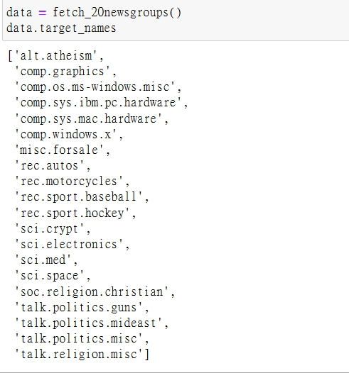
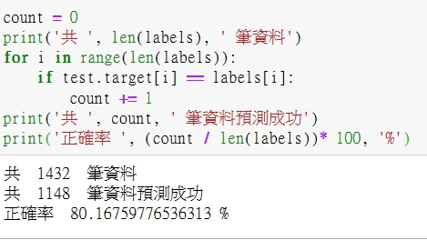
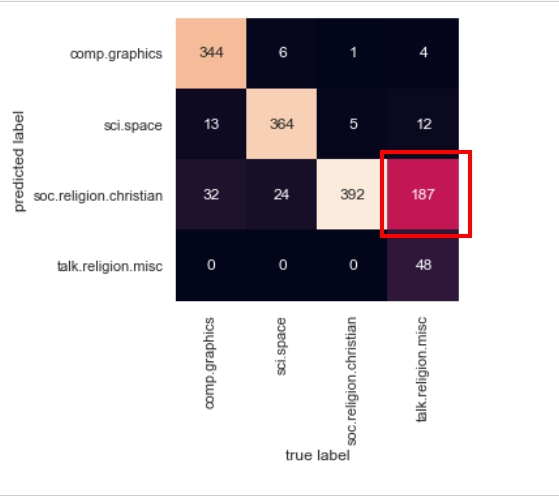

# 多項貝氏分類（應用）

<br>

這一篇來看一下如何使用多項貝氏分類器實作一個文章分類的預測

<br>

## 實作

* 首先，讓我們匯入一下需要使用到的 :

    ```py
    from sklearn.datasets import fetch_20newsgroups
    ```

    sklearn.datasets 裡面就有很多可以供我們練習使用的資料集，我們這裡匯入了 20 個新聞群組資料

    來看一下群組裡面的新聞類別吧 :

    ```py
    data = fetch_20newsgroups()
    data.target_names
    ```

    這一步會比教花時間，因為要從遠端拉 14MB 資料下來，當完成實，會看到以下畫面 : 

    

    共 20 大類。

    <br>

* 接下來就來截選出我們需要使用的 4 組資料。

    ```py
    categories = ['talk.religion.misc', 'soc.religion.christian','sci.space', 'comp.graphics']
    train = fetch_20newsgroups(subset='train', categories=categories)  # 訓練用資料
    test = fetch_20newsgroups(subset='test', categories=categories)  # 實際預測資料
    print(len(train.data))  # 共 2513 篇文章
    
    import pandas as pd
    print(pd.unique(train.target))  # 可以看到 target 一共就是我們選定的那 4 大類 0 ~ 3
    ```

    <br>

* 為了讓這些數據可以適用於機器學習，因此，需要把每個字串轉換為數字向量(TF-IDF向量化)，TfidfVectorizer()

    ```py
    from sklearn.feature_extraction.text import TfidfVectorizer
    from sklearn.naive_bayes import MultinomialNB
    from sklearn.pipeline import make_pipeline

    model = make_pipeline(TfidfVectorizer(), MultinomialNB())  # 字串轉換為數字向量(TF-IDF向量化)

    model.fit(train.data, train.target)  #  餵入 train 資料
    labels = model.predict(test.data)  # 預測 test 資料
    ```

    現在我們已經把 test 資料的分類預測做好了，labels 就是預測好的標籤陣列。

    <br>

*   我們來手動比對看看

    ```py
    count = 0
    print('共 ', len(labels), ' 筆資料')
    for i in range(len(labels)):
        if test.target[i] == labels[i]:
            count += 1
    print('共 ', count, ' 筆資料預測成功')
    print('正確率 ', (count / len(labels))* 100, '%')
    ```

    輸出結果 : 

    

    可以看到準確率達到 80% 還算不錯。

    <br>

* 經過測試數據的標籤並對它們進行評估，以了解估算器的精確度。以下是測試數據的真實和預測標籤之間的混淆矩陣：

    ```py
    import matplotlib.pyplot as plt
    import seaborn as sns; sns.set()
    from sklearn.metrics import confusion_matrix

    mat = confusion_matrix(test.target, labels)
    sns.heatmap(mat.T, square=True, annot=True, fmt='d', cbar=False,
                xticklabels=train.target_names, yticklabels=train.target_names)
    plt.xlabel('true label')
    plt.ylabel('predicted label')
    ```

    看結果 : 

    

    透過混淆矩陣圖，我們可以看到，正確的分類總是占多數的，除了 talk.religion.misc 以外。共 187 筆資料被錯誤的預測成 soc.religion.christain，也許都是因為是宗教相關的文章 ? 這就需要實際的在去看看文章內容才能得到結論。

