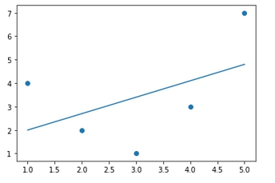
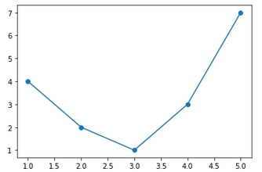

# 特徵工程(Feature Engineering)

<br>

## 數字分析

* 假如我們有一組售屋資料如下 :

    | Price | Rooms | Neighborhood |
    |:----:|:---:|:---:|
    |850000| 4 | Queen Anne |
    |700000| 3 | Fremont |
    |650000| 3 | Wallingford |
    |600000| 2 | Fremont |

    我們來使用 sklern 的分類特徵工能來分類看看能得到什麼結果

<br>

* 先 import 套件 : 

    ```python
    from sklearn.feature_extraction import DictVectorizer
    ```

* 輸入資料組 : 

    ```python
    data = [
        {'price': 850000, 'rooms': 4, 'neighborhood': 'Queen Anne'},
        {'price': 700000, 'rooms': 3, 'neighborhood': 'Fremont'},
        {'price': 650000, 'rooms': 3, 'neighborhood': 'Wallingford'},
        {'price': 600000, 'rooms': 2, 'neighborhood': 'Fremont'}
    ]
    ```

* 分析轉換資料 : 

    ```python
    vec = DictVectorizer(sparse=False, dtype=int)  # sparse 為是否開啟稀疏矩陣
    vec.fit_transform(data)
    ```

    到這邊就可以得到一個分析後的矩陣 : 

    ```python
    array([[     0,      1,      0, 850000,      4],
           [     1,      0,      0, 700000,      3],
           [     0,      0,      1, 650000,      3],
           [     1,      0,      0, 600000,      2]])
    ```

    然而我們並不知道這個矩陣代表什麼意思，執行以下片段可以得到欄位名稱 : 

    ```python
    vec.get_feature_names()
    ```

    結果如下 : 

    ```py
    ['neighborhood=Fremont', 'neighborhood=Queen Anne', 'neighborhood=Wallingford', 'price', 'rooms']
    ```

    為了方便看，這邊整理成表格呈現 :　

    | Fremont | Queen Anne | Wallingford | price | rooms |
    |:----:|:----:|:----:|:----:|:----:|
    | 0 | 1 | 0 | 850000 | 4 |
    | 1 | 0 | 0 | 700000 | 3 |
    | 0 | 0 | 1 | 650000 | 3 |
    | 1 | 0 | 0 | 600000 | 2 |

    表格所表達的 0 代表沒有，1 代表有，當我們把我們看得懂的數據轉換成像這樣的 0 與 1 時，就可以交給機器去做分析了。

<br>

---

<br>

## 多項式特徵

* 之前提到的線性回歸，我們提供的數據太過於完美，x y 等比例上升就可以畫出一個筆直的預測線，那如果數據不如預期呢，像是這樣 :　

    | x | y |
    |:-:|:-:|
    | 1 | 4 |
    | 2 | 2 |
    | 3 | 1 |
    | 4 | 3 |
    | 5 | 7 |

    我們直接嘗試用先前的做法繪製預測線 : 

    ```python
    %matplotlib inline
    import numpy as np
    import matplotlib.pyplot as plt
    from sklearn.linear_model import LinearRegression

    x = np.array([1, 2, 3, 4, 5])
    y = np.array([4, 2, 1, 3, 7])

    X = x[:, np.newaxis]
    model = LinearRegression().fit(X, y)
    yfit = model.predict(X)

    plt.scatter(x, y)
    plt.plot(x, yfit);
    ```

    畫出結果如圖 : 

    

    這很明顯不是一個相對準確的預測，所以我們要從線性回歸直接轉換為多項式回歸，做法如下 : 


    * 先 import 套件 : 
        ```python
        from sklearn.preprocessing import PolynomialFeatures
        ```

    * 初始化多項式回歸模型
        ```python
        poly = PolynomialFeatures(degree=4, include_bias=False)  # degree=4 初始化 4 個次方
        X2 = poly.fit_transform(X)
        print(X2)
        ```

        看一下新的 x 參數陣列 X2 : 

        ```py
        [[  1.   1.   1.   1.]
         [  2.   4.   8.  16.]
         [  3.   9.  27.  81.]
         [  4.  16.  64. 256.]
         [  5.  25. 125. 625.]]
        ```

        可以看的出，x 陣列開出了 1 ~ 4 各次方，這樣再輸入給模型時，當 x 經過多個次方之後的 y 值還是原來的值不變，實際上在繪圖時可以畫出一個波浪線。

    * 再次使用線性回歸模型 : 

        ```python 
        model = LinearRegression().fit(X2, y)
        yfit = model.predict(X2)

        plt.scatter(x, y)
        plt.plot(x, yfit);
        ```

        繪製圖像如下 : 

        
