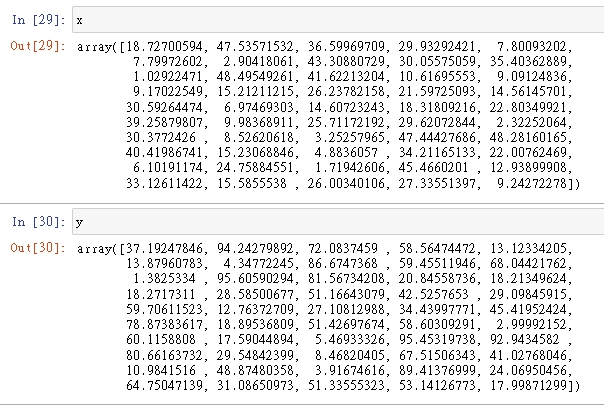
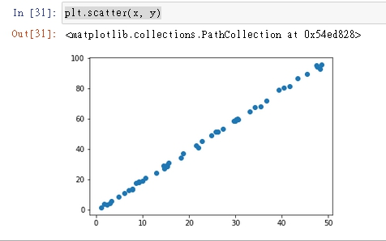
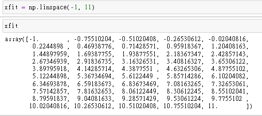
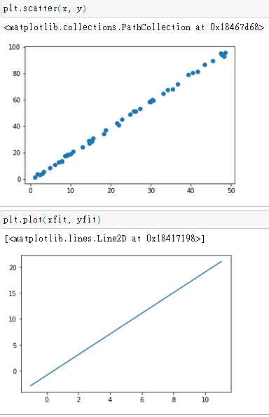

# 線性回歸

<br>

## 依賴需要

```python
import matplotlib.pyplot as plt
import numpy as np
from sklearn.linear_model import LinearRegression
```

<br>


## 建立測試數據

```python 
rng = np.random.RandomState(42)  # 42 為 random 種子數，確保產生亂數每次都一樣
x = 50 * rng.rand(50)  # 50 個隨機數陣列
y = 2 * x - 1 + rng.randn(50)  # y 接近2倍 x
```

看一下數值大概 : 



畫圖來看一下數據分佈 : 



<br>

## 建立數學模型

使用 LinearRegression 線性規劃模型
 
```python
model = LinearRegression(fit_intercept=True)  # 使用 fit_intercept 來擬合截距
```

然後把資料規劃到特徵矩陣和目標向量中

```python
X = x[:, np.newaxis]  # 將小 x 陣列轉置變成一個 2 維陣列
X.shape  # 看一下大 X 的形狀
model.fit(X, y)  # 把資料餵給模型
```

我們可以看到大 X.shape 結果為 (50, 1) 義為 列=50 , 欄=1。

<br>

## 建立未知資料 : 

```python
xfit = np.linspace(-1, 11)  # 建立 1~11 等差數列
```

直接看一下資料吧 : 




把 xfit 資料轉變為 2 為陣列，並直接用 xfit 預測 yfit

```python
Xfit = xfit[:, np.newaxis]
yfit = model.predict(Xfit)
```

<br>

## 畫圖

分別印出原本的數據分佈與預測數據回歸線對比看看
```python
plt.scatter(x, y)
#################
plt.plot(xfit, yfit)
```


<br>

## 重點整理
```python
model.fit(輸入樣本，輸出標籤)

model.predict(输入样本)
    return -> 預測輸出
```