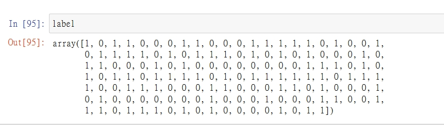

# 貝氏分類器

<br>

單純貝氏是一種構建分類器的簡單方法。 該分類器模型會給問題實例分配用特徵值表示的類標籤，類標籤取自有限集合。 它不是訓練這種分類器的單一演算法，而是一系列基於相同原理的演算法：所有單純貝氏分類器都假定樣本每個特徵與其他特徵都不相關。

## 實作

* 基本 import 宣告 : 
    ```py
    %matplotlib inline
    import numpy as np
    import matplotlib.pyplot as plt
    import seaborn as sns; sns.set()

    from sklearn.datasets import make_blobs
    ```

* 生成 2 堆數據

    ```py
    data, label = make_blobs(150, 2, centers=2, random_state=2, cluster_std=1.5)
    # make_blobs(樣本總數, 每個樣本特徵數, 樣本中心點, 隨機種子數, 類別平方差)
    # 這邊 樣本中心點設定為 2，所以會平均產出 2 群集中數組。
    # label 為這 150 個數組的分群標籤，一共分 2 群，所以標籤只會出現 1 or 2。
    ```

* 來看一下生成的 2 堆數據大概樣子吧 : 

    * `data[:, 0]` 150 筆資料 : （x 軸資料）
    

    * `data[:, 1]` 150 筆資料 : （y 軸資料）
    

    * 把 x y 在直腳座標上點出來 : 

        ```py
        plt.scatter(X[:, 0], X[:, 1], s=50);
        ```

        

    * 再來看一下 label 分群狀況 : 

        

        可以看到數組被平均的非為了 0 和 1兩組。

* 再來把分群資訊丟給化圖套件呈現 : 

    ```py
    plt.scatter(data[:, 0], data[:, 1], c=label, s=50, cmap='RdBu');
    ```
    圖像 : 

    

    可以看到，我們把 scatter 的 `c` 參數設定為分組的 label 陣列，當label 為 0 時，呈現紅色，當 label 為 1 時呈現藍色，這樣用顏色區分我們就可以很清楚的看到分組的區域。

    <br>
    <br>

* 高斯數學模型

    創建貝氏模型的一種非常快速的方法就是假設數據由高斯分佈描述，維度之間沒有平方差關係。只需找到每個標籤內各點的平均值和標準差即可擬合此模型。

    * import 套件宣告 : 

        ```py
        from sklearn.naive_bayes import GaussianNB
        ```

    * 初始化高斯模型，並餵給資料 : 

        ```py
        model = GaussianNB()
        model.fit(data, label); # 把 (x, y) 資料陣列以及 (label) 分群資料餵給高斯模型
        ```

    * 產生測試所需的資料 : ＿

    