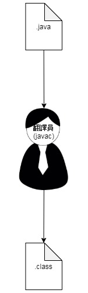
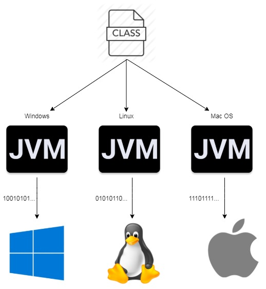
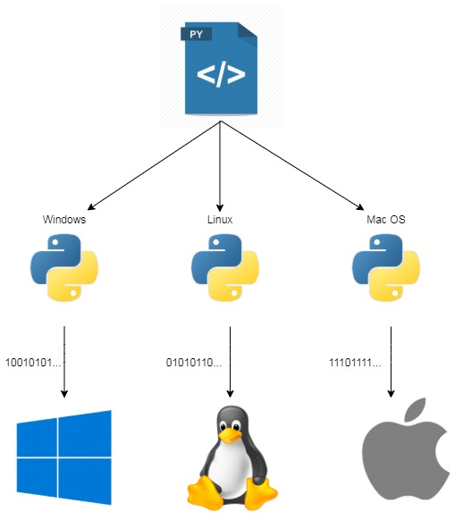

# 動態語言 vs 靜態語言

<br>
<br>

## 靜態語言(編譯語言)

* 靜態語言就拿 java 舉例，當我們編寫了一段 java 文件，像這樣 : 

    ```java
    public class Main{
        public static void main(String... args){
            System.out.println("Hello World");
        }
    }
    ```

    以上程式直接拿給電腦看，電腦怎麼看得懂呢 ? 電腦又不懂英文，它只看得懂 1010101...
    所以就需要有一個翻譯員幫我們翻譯一下我們人類寫的指令給機器看。
    
* 在寫 java 的時候，我們都知道寫好的 .java 檔需要通過 jdk 的 javac 工具編譯成 .class 再給 JVM 執行。javac 就是我們的翻譯員，他將我們的願望翻譯成機器碼（10101...）.class 文件。然後再拿去給實際的執行者 JVM 去執行指令。

* 這種需要事前編譯好再執行的語言就叫做靜態語言，在編譯階段翻譯員（javac）就會幫你檢查看看你寫的語言有沒語病。都沒有問題之後，他就幫你翻譯成機器碼。

    

    <br>

* java 翻譯成 .class 之後就可以直接讓電腦執行了嗎 ? 答案是不。拿 windows 舉例，windows 系統可以直接拿來執行的機器碼檔案是 .exe 檔。Unix like 作業系統可以直接拿來執行的檔案又是另外一種。這導致一個問題，各個 OS 平台所支援的機器碼都不一樣，比如說要 windows 跟 linux 執行 print hello world 任務，它們的所能理解的機器碼可能分別如下 : 

    * windows

        ```bash
        101100101110... (print "hello world")
        ```

    * linux

        ```bash
        010001110111... (print "hello world")
        ```

    都是執行 print "hello world" 任務，但是機器碼完全不一樣。java 是一個跨平台語言，所以 java 是如何解決這種問題的呢。

    <br>

    事實上，java 文件不管在任何平台上編譯的 .class 都長一樣，當編譯好之後，我們需要把 .class 文件拿給所屬平台的 "代理者" 執行，這個代理者就是 JVM (Java Virtual Machine)。

* Sun 公司在開發 java 語言時就針對每一個 OS 平台實作了專屬的 JVM，每一個 JVM 拿到的 .class 文件都一樣，但是他們可以分別把 .class 文件再變成對應 OS 平台的機器碼。示意圖如下 : 

    

    這樣就達到 java 跨平台的目的。


    <br>
    <br>
    <br>
    <br>

---

<br>
<br>

## 動態語言(直譯語言)

* 動態語言就拿 python 舉例，當我們寫了一個 .py 文件 : 

    ```py
    print("hello world")
    ```

    直接拿給電腦看，電腦一樣看不懂阿，那我們是不是一樣要拿去給編譯器編譯成某某機器碼嗎 ?答案是不。

    python 做為一個直譯語言，就是不用透過編譯，直接把 source code 拿去給直譯器直翻給電腦看就好了，不必其實講的再執白一點，python 直譯器就類似於 java 把 javac 跟 JVM 整合成一個東西，"翻譯員" 跟 "代理者" 變成通一個人，同時也要滿足跨平台需求，示意圖如下 : 

    

    <br>

* 相比 java 的先翻譯全篇英文指令再交給 JVM 執行，python 則是一邊翻譯一邊執行，所以不會事先就幫你檢察好你寫的指令是否完全正確，要 "走一步算一步"，正因為這樣的特性，才允許像 python 這種動態語言不用做資料型別檢查以及可以動態的改變物件及方法屬性 : 

    型別檢查

    * java 強型別檢查

        ```java
        public class Main{
            public static void main(String... args){
                int a = 10;
                a = "Hello World";  // 錯誤
            }
        }
        ```

    * python 弱型別檢查

        ```py
        a = 10
        a = "Hello World"  # 正確
        ```

    <br>

    動態添加屬性


    * java 類別

        ```java
        public class People{
            public String name = "";
            public int age = 0;

            public String returnName(){
                return this.name;
            }

            public static void main(String... args){
                People man = new People();
                man.address = "NetPro";  // 錯誤
            }
        }
        ```

    * python 類別

        ```py
        class People:
            def __init__(self):
                self.name = ""
                self.age = 0

            def returnName(self):
                return self.name

        def sayHello():
            return "Hello World!"

        if __name__ == '__main__':
            man = People()
            man.address = "NetPro"  # 正確
            man.returnName = sayHello  # 正確
            man.sayHello = sayHello
            sayHello = lambda: "nothing to say."

            print("man 的 returnName() : ", man.returnName())
            print("man 的 sayHello() : ",man.sayHello())
            print("sayHello() : ", sayHello())
        ```

        console : 

        ```bash
        man 的 returnName() :  Hello World!
        man 的 sayHello() :  Hello World!
        sayHello() :  nothing to say.

        Process finished with exit code 0
        ```

        <br>


    得益於直譯程式的架構，python 在編寫時較為自由靈活，但是相對的也比較不嚴謹。