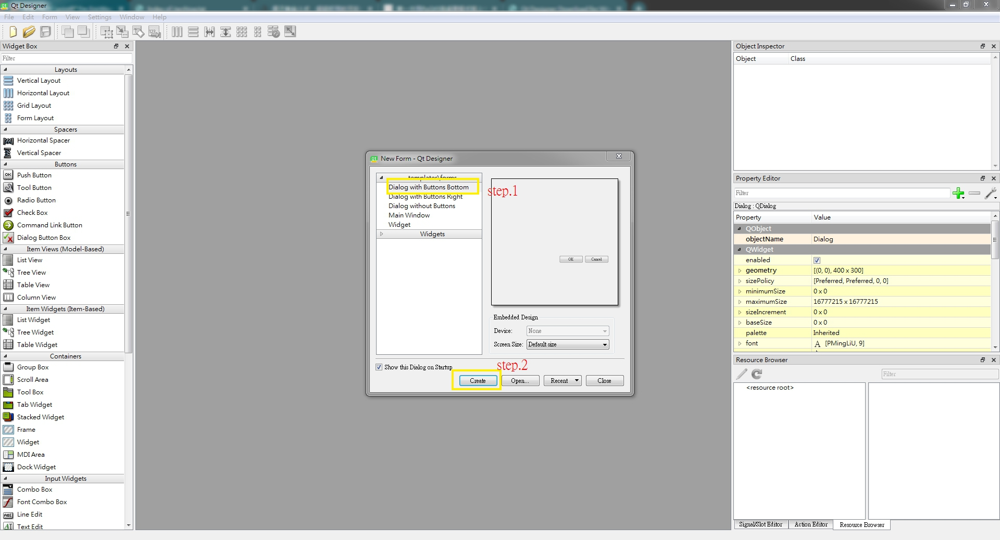
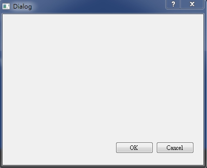
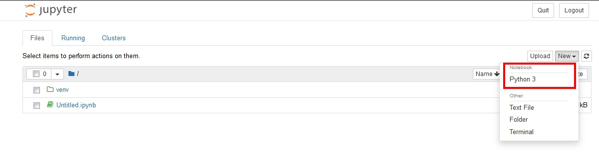
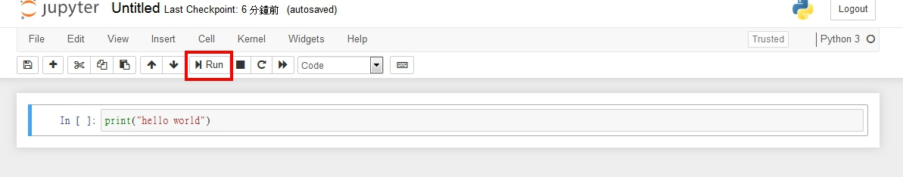
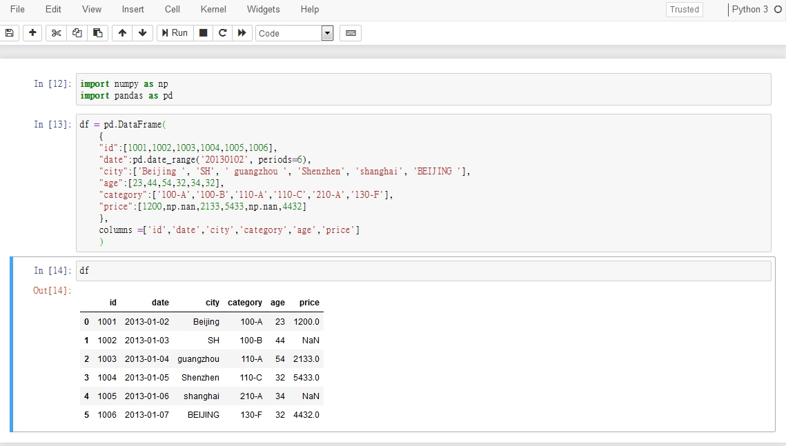
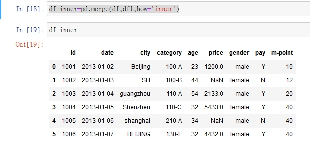
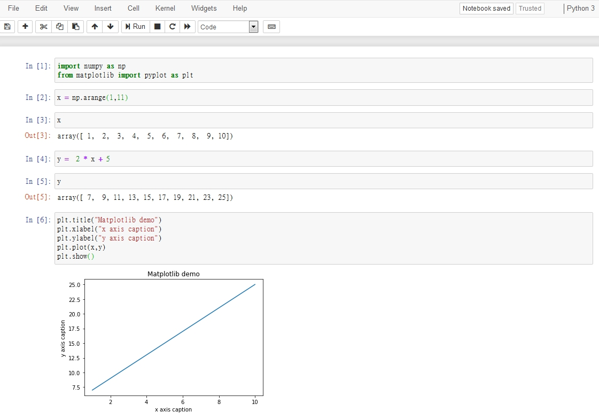
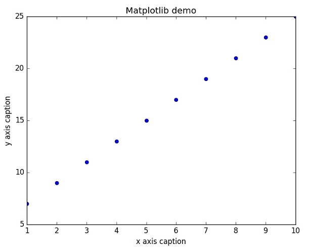
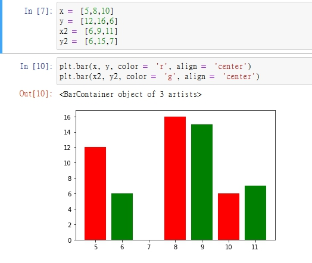

# 為甚麼學 python

<br>

---

<br>

## 一. python 的應用面

1.  系統編程

    Python 對作業系統服務的內置接口，使其成為編寫可移植的維護作業系統的管理工具和部件（有時也被稱為Shell 工具）的理想工具。Python 程序可以搜索文件和目錄樹，可以運行其他程序，用進程或線程進行並行處理等等。

    <br>

2. GUI

    Python 的簡潔以及快速的開發周期十分適合開發 GUI 程序。使 Python 程序可以生成可移植的本地觀感的 GUI 。Python/ Tkinter GUI 不做任何改變就可以運行在微軟Windows 、X Windows（UNIX 和Linux ）以 及Mac OS（Classic 和OS X 都支持）等平台上。

    使用到的套件 : pyQT

    * 在使用 pyQT 開發 GUI 時，要先去下載 QT designer 軟體，這邊附上下載網址 : 

        https://build-system.fman.io/qt-designer-download

    * 使用 QT designer 建立一個 UI 元件 : 

        

        然後儲存到專案資料夾下，命名為 `myui.ui`

    * 使用 pip 安裝以下套件 : 

        ```bash
        pip install pyqt5
        pip install pyqt5-tools
        ```

        其中 pyqt5 是我們開發 GUI 主要的套件，pyqt5-tools 是用來把 .ui 文件轉譯成 .py 文件的。

    * 在 cmd 轉換 myui.ui 變成 myui.py : 

        ```bash
        pyuic5 myui.ui -o myui.py
        ```

    * 打開專案編輯 main.py 如下 : 

        ```py
        import sys
        from PyQt5.QtWidgets import QApplication, QDialog, QMessageBox
        from myui import Ui_Dialog
        class MyDlg(QDialog):
            def __init__(self):
                super(MyDlg, self).__init__()

                # Set up the user interface from Designer.
                self.ui = Ui_Dialog()
                self.ui.setupUi(self)

        def main_start():
            app = QApplication(sys.argv)
            window = MyDlg()
            window.show()
            sys.exit(app.exec_())


        if __name__ == '__main__':
            main_start()
        ```

        直接執行後，可以看到會跳出一個視窗程式 :

        


    <br>

3. 爬蟲程式

    Python 有許多支援爬蟲開發功能強大的套件。可以快速的針對目標網站進行針對性爬蟲開發。可以為大數據分析做前置的資料蒐集工作。

    爬蟲需要用到的套件為 requests bs4 selenium。

    * requests 套件 -> http request sender : 

        ```py
        import requests

        resp = requests.get("https://www.netpro.com.tw")
        resp.encoding = "ytf-8"
        print(resp.text)
        ```

    * bs4 套件 -> html 分析過濾工具 : 

        ```py
        from bs4 import BeautifulSoup

        html = "<html><body><div id='app'>hello world</div></body></html>"

        soup = BeautifulSoup(html, features="html.parser")
        print(soup.find("div", id="app").getText())
        ```

    * selenium 套件 -> web 爬蟲最強工具
        ```py
        import selenium.webdriver as driver

        selenium_driver_path = "D:\driver\geckodriver.exe"  # Browser driver 驅動路徑
        browser = driver.Firefox(executable_path=selenium_driver_path)
        browser.get("https://www.netpro.com.tw")
        print(browser.page_source)
        ```
    <br>

4. 數值計算和科學計算

    Python 有許多高級的第三方工具，可以將 Python 語言變成一個縝密嚴謹並簡單易用的數值計算工具，搭配一些圖像觸理套件，可以將資料變成動畫，3D，等視覺化處理。非常適合用於資料科學領域應用。可應用套件組 : 

    * Jupyter (python 科學運算模式)
    
    * NumPy (支援高階大量的維度陣列與矩陣運算)
    
    * Pandas (基於numpy為基礎的庫，是一個能讓使用者方便讀取儲存資料的函數庫)
    
    * Matplotlib (NumPy的可視化操作界面，資料視覺化)

    <br><br>

    這邊一一做簡單介紹

    <br>

    * Jupyter

        安裝 + 執行

        ```bash
        pip install jupyter
        jupyter notebook
        ```

        執行過後可以打開瀏覽器輸入 http://localhost:8888 進入 Jupyter 開發模式，這邊直接開啟一個專案

        

        然後可以看隨便寫一點東西測試 Run 看看。

        

        <br><br>

    * NumPy

        安裝 : 

        ```bash
        pip install numpy
        ```

        這邊給幾各實測範例 :

        ```python
        import numpy as np

        ## 使用 numpy 建立陣列 ##
        # ！ 注意 ： numpy 跟標準 python 陣列不一樣，numpy 的陣列元素形態必須統一，
        #          如果在一個整數陣列中插入一個 float，會悄悄轉型成 int。

        # 常態宣告一維陣列
        a0 = np.array((1, 2, 3, 4, 5))

        # 建立一個長度爲 10 內容皆為 0 的 int 陣列
        a1 = np.zeros(10, dtype=int)

        # 建立一個內容皆為 1 的 3*5 float 陣列
        a2 = np.ones((3, 5), dtype=float)

        # 建立一個內容皆為 3.14 的 3*5 陣列
        a3 = np.full((3, 5), 3.14)

        # 建立一個依序填滿的陣列 0~20(exclude 20) 以 2 為間隔
        a4 = np.arange(0, 20 ,2)

        # 建立一個五個值陣列，在 0~1 之間平均分佈
        a5 = np.linspace(0, 1, 5, dtype=float)

        # 建立一個平均分佈的 3*3 陣列，在 0~1 之間。
        a6 = np.random.random((3, 3))

        # 建立一個 3*3 陣列，常態分佈亂數，平均值爲 1，標準差爲 0
        a7 = np.random.normal(0, 1, (3, 3))

        # 建立一個 3*3 陣列，內容介於 0~10 之間
        a8 = np.random.randint(0, 10, (3, 3))

        # 建立一個 3*3 的單位矩陣
        a9 = np.eye(3)

        # 建立一個長度爲 3 的未初始化陣列，其值爲原記憶體位址中的值
        a10 = np.empty(3)
        ```

        點 [這邊](https://github.com/Johnny1110/python_data_science/tree/master/pynum-example) 看更多

    <br><br>

    * Pandas 
    
        安裝 :

        ```python
        pip install pandas
        ```

        一般 pandas 都要與 numpy 搭配使用，這邊可以先都 import : 

        ```python
        import numpy as np
        import pandas as pd
        ```

        用 pandas 導入 .xlsx 或 .csv 檔 :

        ```python
        df = pd.DataFrame(pd.read_csv('name.csv',header=1))  # header=1 指定第一列為列名
        df = pd.DataFrame(pd.read_excel('name.xlsx'))
        ```

        用 pandas API 自行建立資料 : 

        ```python
        df = pd.DataFrame(
            {
            "id":[1001,1002,1003,1004,1005,1006], 
            "date":pd.date_range('20130102', periods=6),
            "city":['Beijing ', 'SH', ' guangzhou ', 'Shenzhen', 'shanghai', 'BEIJING '],
            "age":[23,44,54,32,34,32],
            "category":['100-A','100-B','110-A','110-C','210-A','130-F'],
            "price":[1200,np.nan,2133,5433,np.nan,4432]
            },
            columns =['id','date','city','category','age','price']
            )
        ```

        在 Jupyter 看資料 : 

        


        pandas 基礎操作 : 

        ```python
        # 維度查看
        df.shape

        # 資料基本信息
        df.info

        # 每一列資料格式
        df.dtypes

        # 是否為 null
        df.isnull()

        # 查看某一列唯一值
        df['RowName'].unique()
        ```

        pandas 進階操作

        ```python
        # 先建立一個數組 ( 上面範例 df 的補充項 )
        df1=pd.DataFrame({
                "id":[1001,1002,1003,1004,1005,1006,1007,1008], 
                "gender":['male','female','male','female','male','female','male','female'],
                "pay":['Y','N','Y','Y','N','Y','N','Y',],
                "m-point":[10,12,20,40,40,40,30,20]
                })

        # 使用 inner join 方式合併 df 跟 df1
        df_inner=pd.merge(df,df1,how='inner')
        ```

        結果 : 

        

        pandas 資料篩選 : 

        ```python
        # 篩選年紀大於 20 的男性
        df_inner.loc[(df_inner['age'] > 20.0) & (df_inner['gender'] == 'male'), ['id','city','age','category','gender']]

        # 篩選類別非 '100-A' 的成員
        df_inner.loc[(df_inner['category'] != '100-A'), ['id','city','age','category','gender']]

        # 對類別為 110-A, 110-C 的成員 price 欄位進行加總
        df_inner.query('category == ["110-A", "110-C"]').price.sum()

        # 隨機採樣(取 3 筆，每次執行結果都不一樣)
        df_inner.sample(n=3)
        ```

        資料寫回 .csv 或 .xlsx 檔 : 

        ```python
        df_inner.to_excel('myData.xlsx', sheet_name='my_sheet')

        df_inner.to_csv('myData.csv')
        ```

    <br>
    <br>
    <br>

    * Matplotlib

        安裝 : 

        ```bash
        pip install matplotlib
        ```

        實例 : 

        ```python
        import numpy as np 
        from matplotlib import pyplot as plt 
    
        x = np.arange(1,11) 
        y =  2 * x + 5 
        plt.title("Matplotlib demo") 
        plt.xlabel("x axis caption") 
        plt.ylabel("y axis caption") 
        plt.plot(x,y) 
        plt.show()
        ```

        結果 :

        

        改用其他格式畫圖 :

        ```python
        plt.plot(x,y,"ob")  # ob 格式
        ```

        結果 :

        


        <br>

        條型統計圖 : 

        ```python
        x =  [5,8,10] 
        y =  [12,16,6] 
        x2 =  [6,9,11] 
        y2 =  [6,15,7]

        plt.bar(x, y, color =  'r', align =  'center') 
        plt.bar(x2, y2, color =  'g', align =  'center') 
        ```
        
        結果 : 

        


        

    <br><br><br><br>

5. 企業與政務應用

    目前，Python 已經成功的實現企業級應用，在全球，已經有很多公司採用 Python 進行企業級軟體的開發和應用並整合進 Web，比如：ERP 和 CRM 這樣的應用。同時，通過 Python 技術，成功的實現了許多政務應用。

    官方整合可供使用套件 : 

    Django

    * cmd 指令建立專案

        ```bash
        django-admin startproject mysite
        ```

    * cmd 運行 web 服務

        ```bash
        cd mysite
        python manage.py runserver
        ```

    * 您將看到如下的 console 資訊

        ```bash
        Performing system checks...

        System check identified no issues (0 silenced).

        You have unapplied migrations; your app may not work properly until they are applied.
        Run 'python manage.py migrate' to apply them.

        February 03, 2020 - 15:50:53
        Django version 3.0, using settings 'mysite.settings'
        Starting development server at http://127.0.0.1:8000/
        Quit the server with CONTROL-C.
        ```
        這代表你已經啟動了 server，打開瀏覽器輸入 http://127.0.0.1:8000/ 就可以造訪網站。

    * 打開 mysite/views.py 檔案，並編寫如下 :

        ```python
        from django.http import HttpResponse


        def index(request):
        return HttpResponse("Hello, world. You're at the polls index.")
        ```

    * 打開 mysite/urls.py 檔案，並編寫如下 :

        ```python
        from django.urls import path

        from . import views

        urlpatterns = [
            path('/', views.index, name='index'),
        ]
        ```

        這樣一來，在瀏覽器輸入 http://127.0.0.1:8000/ 就可以看到招呼語。

    <br><br><br><br>

6.  人工智慧

     python 擁有其他語言使用者都很羨慕的 AI 開發組合包，numpy 、NLTK、sk-learn、scipy、pandas 和 PyTorch。正因為有這些開發工具，才成就了 Python 在目前業界 AI 開發語言排名第一的地位。

     開發套件快速導覽 : 

     * sk-learn

        * [線性回歸](./sklearn/線性回歸.md)


        


<br><br>

## Python 的定位

* Python 的定位是什麼其實很簡單，就是一種簡單、易用但專業、嚴謹的通用組合語言，或者叫膠水語言，讓普通人也能夠很容易的入門，把各種基本程式元件拼裝在一起，協調運作就好。

* 開發 Python 的過程有點像是在搭積木，不用自己砍樹鋸木，只要按照說明書把積木搭好就可以了。另一種層面上說，與其說是在寫 python 語言，不如說是在用 python 工具，感覺就像是在使用 word、excel、ppt 一樣。


