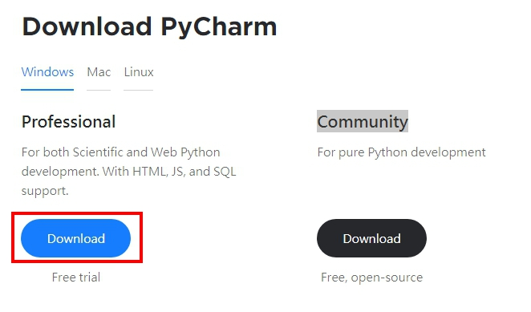
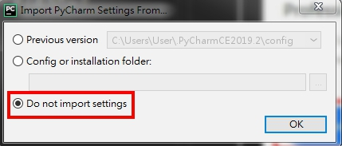
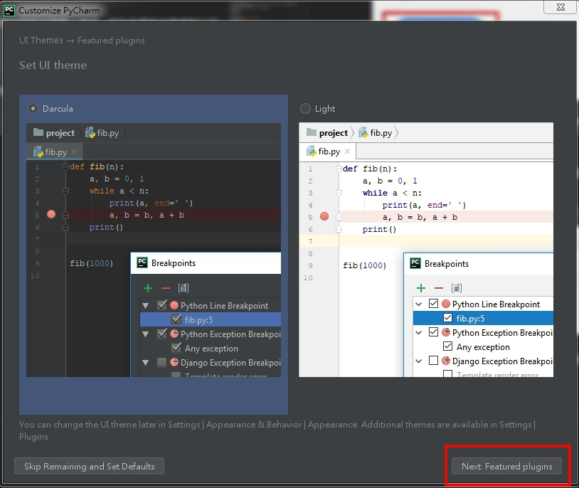
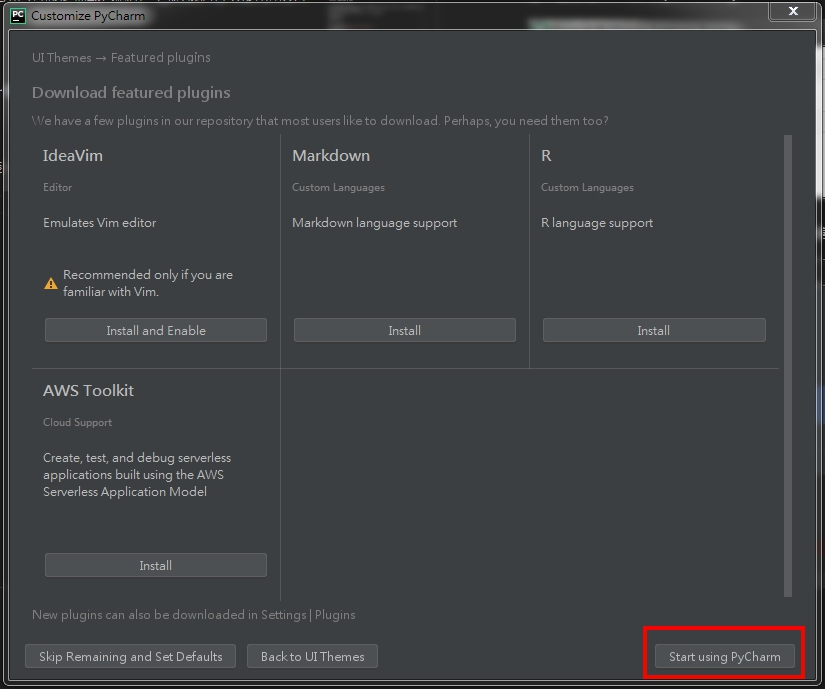
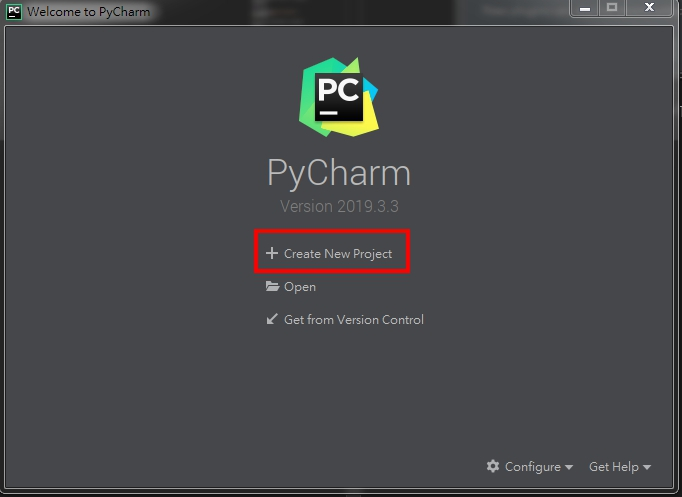
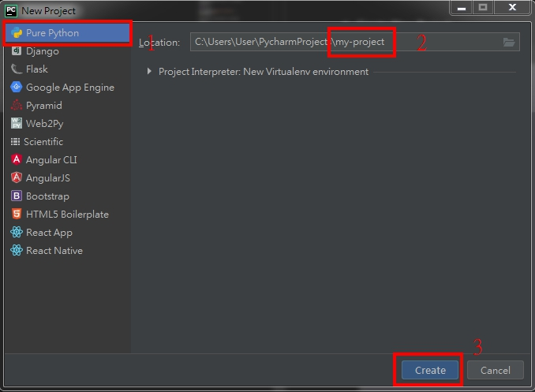
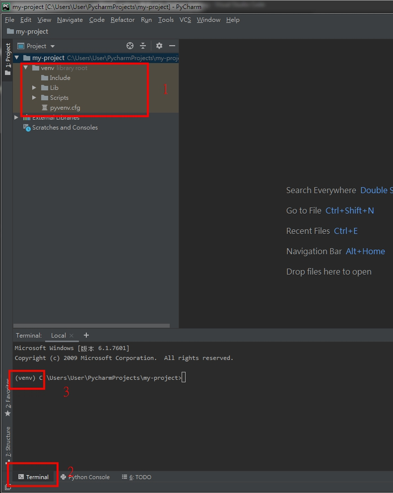
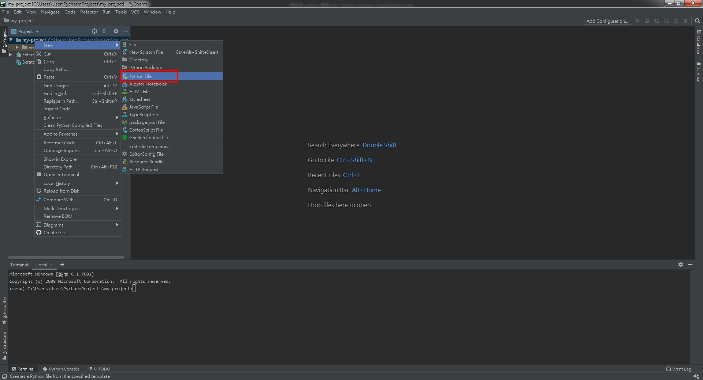
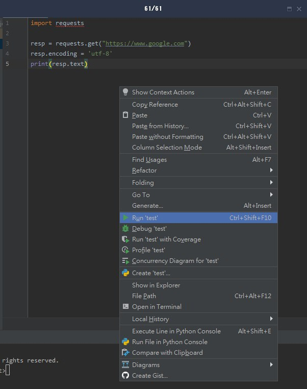
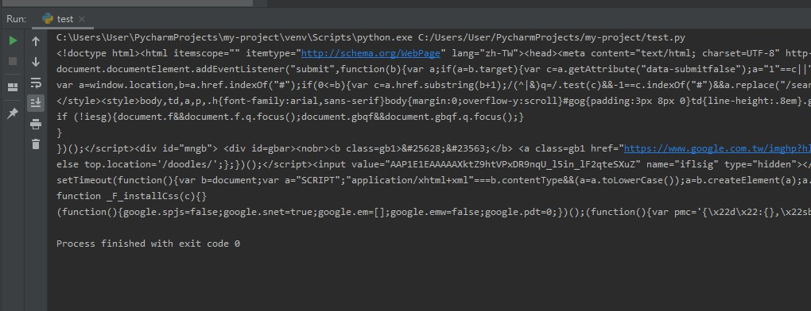

# 開始編寫 python 專案

<br>

這一篇將教大家如何手動建立一個專案，以及如何使用強大的 IDE 工具。

<br>

## 手動健置專案

* virtualenv 這個套件之前有提到過，這邊不多做潺述，我們先在 D 槽開一個資料夾並建立虛擬環境 : 

    ```bash
    cd D:
    mkdir my-project
    cd my-project
    virtualenv --no-site-packages venv
    ```

* 這樣一來就建立好一個專案了，接下來我門開啟 venv 試著下載一個 requests 套件 : 

    ```bash
    cd venv\Scripts
    activate
    ```

    activate 啟動成功之後 cmd 前面會有一個虛擬環境名稱 : 

    

    接下來看看我們的環境裡以安裝了哪些套件 : 

    ```bash
    pip list
    ```
    

    使用 pip 工具下載 requests 套件 : 

    ```bash
    pip install requests
    ```

    安裝成功後，再次用 `pip list ` 檢查一下 : 

     


    會發現除了 requests 以外又多出了一些不知道的套件，這些套件都是 requests 所依賴的底層套件， pip 為我們把這些套件依賴關系都處理好了。

    我們直接在 my-project/ 資料夾中建立一個  test.py 文件 : 

    並編輯內容如下 : 

    ```py
    import requests

    resp = requests.get("https://www.google.com")
    resp.encoding = 'utf-8'
    print(resp.text)
    ```

    最後，我們直接使用 python 直譯器執行 test.py 文件 : 

    ```bash
    python test.py
    ```

    在 console 就可以看到 google 主頁的 html 標籤了。


<br>
<br>

---

<br>
<br>

## 使用工具 : PyCharm

* PyCharm 是一個強大的 Python IDE 工具，可以幫助開發者快速的進行開發工作。PyCharm 是 JetBrain 家的產品，其有 2 種發行版，一個是 Professional 版，一個是 Community 版。Professional 版需要訂閱繳費，Community 是免費，實際上我們剛入門用不到 Professional 那麼好的功能，所以用 Community 版就好了。

    下載網址 : https://www.jetbrains.com/pycharm/download/#section=windows

    


    下載好後點擊打開一直看 `next` 到最後即可，中間不需要任何選取操作。

    <br>

* 下載完成後點開執行，我們首先會看到一個介面，詢問我們要不要使用已有設定檔載入應用，因為我們首次使用所以不需要理會，直接選 Do not import settings。

    

    然後 PyCharm 會讓我們選取一種介面風格，這邊隨個人喜好選一個就好，選好就按 `next`

    

    接下來會問我們要不要安裝 plugin，我們不需要，所以不用安裝，直接跳過。

    

    以上我們就完成安裝，接下來說明一下如何使用 PyCharm 建立一個專案吧。

    <br>

* Create New Project

    

* 設定專案類型以及名稱 : 

    


* 當開起專案後我門檢查一下使否成功啟用 virtualenv。

    

    檢查一 : venv 資料夾中檔案是否齊全。

    檢查二 : 點開 terminal 看一下 cmd 前面是否已經啟用 `(venv)`

    <br>

* 建立一個 python 文件，命名為 test.py : 

    

* 在文件中編寫以下程式碼 : 

    ```py
    import requests

    resp = requests.get("https://www.google.com")
    resp.encoding = 'utf-8'
    print(resp.text)
    ```

    編寫好後，我們按右鍵執行看看 :

    


    不出意外，會看到錯誤訊息，ModuleNotFoundError: No module named 'requests'。

    這是正常的，因為我們還沒有 install requests 套件，馬上試看看。

    在 terminal 輸入 `pip install requests` 並按 enter 執行，安裝完成後再視著執行一次 : 

    

    以上就是這篇章節所有內容。
