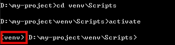
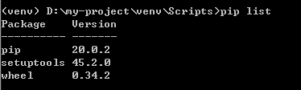
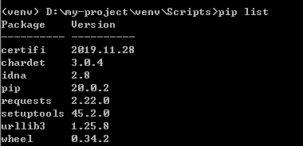

# 開始編寫 python 專案

<br>

這一篇將教大家如何手動建立一個專案，以及如何使用強大的 IDE 工具。

<br>

## 手動健置專案

* virtualenv 這個套件之前有提到過，這邊不多做潺述，我們先在 D 槽開一個資料夾並建立虛擬環境 : 

    ```bash
    cd D:
    mkdir my-project
    cd my-project
    virtualenv --no-site-packages venv
    ```

* 這樣一來就建立好一個專案了，接下來我門開啟 venv 試著下載一個 requests 套件 : 

    ```bash
    cd venv\Scripts
    activate
    ```

    activate 啟動成功之後 cmd 前面會有一個虛擬環境名稱 : 

    

    接下來看看我們的環境裡以安裝了哪些套件 : 

    ```bash
    pip list
    ```
    

    使用 pip 工具下載 requests 套件 : 

    ```bash
    pip install requests
    ```

    安裝成功後，再次用 `pip list ` 檢查一下 : 

     


    會發現除了 requests 以外又多出了一些不知道的套件，這些套件都是 requests 所依賴的底層套件， pip 為我們把這些套件依賴關系都處理好了。

    我們直接在 my-project/ 資料夾中建立一個  test.py 文件 : 

    並編輯內容如下 : 

    ```py
    import requests

    resp = requests.get("https://www.google.com")
    resp.encoding = 'utf-8'
    print(resp.text)
    ```

    最後，我們直接使用 python 直譯器執行 test.py 文件 : 

    ```bash
    python test.py
    ```

    在 console 就可以看到 google 主頁的 html 標籤了。


<br>
<br>

---

<br>
<br>

## 使用工具 : PyCharm
